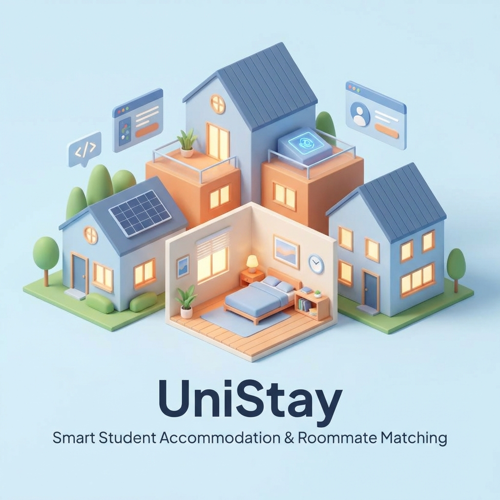

<div align="center">
  

  # 🏠 UniStay - Nền Tảng Tư Vấn Tìm Trọ Thông Minh

  [](https://dotnet.microsoft.com/)
  [](https://docs.microsoft.com/en-us/ef/core/)
  [](LICENSE)
  [](https://github.com/nhotungdo/unistay-web)

  **Giải pháp toàn diện giúp sinh viên và người đi làm tìm kiếm chỗ ở, ghép bạn đồng hành và quản lý cuộc sống tiện nghi.**

  [✨ Khám phá tính năng](#-tính-năng-nổi-bật) • [🚀 Bắt đầu ngay](#-cài-đặt-nhanh) • [📁 Cầu trúc dự án](#-kiến-trúc--cấu-trúc) • [🤝 Đóng góp](#-đóng-góp)
</div>

---

## 💡 Giới Thiệu

**UniStay** không chỉ là một trang web tìm phòng trọ thông thường. Đây là một hệ sinh thái thông minh được thiết kế để giải quyết mọi nỗi lo của người đi thuê trọ: từ việc tìm kiếm một căn phòng ưng ý, đến việc tìm người bạn cùng phòng lý tưởng, và quản lý các dịch vụ đi kèm một cách minh bạch.

### Tại sao chọn UniStay?
- **Tìm kiếm thông minh**: Bộ lọc nâng cao giúp bạn tìm thấy phòng trọ gần trường học, nơi làm việc với mức giá tối ưu.
- **Ghép bạn ở chung**: Thuật toán gợi ý bạn cùng phòng dựa trên tính cách, thói quen và sở thích.
- **Tiện ích Marketplace**: Nơi trao đổi, mua bán đồ dùng cũ chất lượng cao giữa cộng đồng cư dân.
- **Giao tiếp thời gian thực**: Chat trực tiếp với chủ nhà thông qua hệ thống tin nhắn SignalR hiện đại.

---

## ✨ Tính Năng Nổi Bật

| 🔍 Khám Phá & Đặt Phòng | 🤝 Ghép Bạn Ở Chung | 🛒 Marketplace & Dịch Vụ |
| :--- | :--- | :--- |
| • Tìm kiếm với bộ lọc đa chiều | • Tạo profile cá nhân chi tiết | • Mua bán đồ cũ chuyên biệt |
| • Xem chi tiết phòng với hình ảnh | • Gợi ý bạn ở chung phù hợp | • Dịch vụ chuyển trọ trọn gói |
| • Đặt lịch xem phòng trực tuyến | • Chat kết nối trực tiếp | • Thanh lý đồ đạc nhanh chóng |

---

## 🛠️ Công Nghệ Sử Dụng

### **Backend**
<p align="left">
  
  
  
  
  
</p>

### **Frontend**
<p align="left">
  
  
  
  
</p>

---

## 📸 Ảnh Chụp Màn Hình

<div align="center">
  
  
  <br>
  <em>Giao diện hiện đại, thân thiện với người dùng</em>
</div>

---

## 🚀 Cài Đặt Nhanh

### 1. Yêu Cầu Hệ Thống
* .NET 8.0 SDK
* SQL Server 2019+ hoặc LocalDB
* Visual Studio 2022 / VS Code

### 2. Triển Khai
```bash
# Clone repository
git clone https://github.com/nhotungdo/unistay-web.git

# Di chuyển vào thư mục dự án
cd "Unistay Web/Unistay Web"

# Khởi tạo Database
dotnet ef database update

# Chạy ứng dụng
dotnet run
```

Mặc định ứng dụng sẽ chạy tại: `https://localhost:5001`

---

## 📁 Kiến Trúc & Cấu Trúc

```bash
Unistay Web/
├── Controllers/      # Xử lý logic điều hướng và API
├── Models/           # Định nghĩa các thực thể dữ liệu
├── Views/            # Giao diện người dùng (Razor Views)
├── Data/             # Cấu hình Database & Migrations
├── Services/         # Xử lý nghiệp vụ logic độc lập
├── wwwroot/          # Các tệp tĩnh (CSS, JS, Images)
└── ViewModels/       # Các đối tượng dữ liệu cho View
```

---

## 🤝 Đóng Góp

Mọi đóng góp đều được trân trọng! Nếu bạn có ý tưởng mới hoặc phát hiện lỗi, hãy:

1. **Fork** dự án
2. Tạo branch của bạn (`git checkout -b feature/AmazingFeature`)
3. Commit thay đổi (`git commit -m 'Add some AmazingFeature'`)
4. Push lên branch (`git push origin feature/AmazingFeature`)
5. Tạo **Pull Request**

---

## 📝 License

Dự án này được cấp phép dưới **MIT License**. Xem file [LICENSE](LICENSE) để biết thêm chi tiết.

---

<div align="center">
  <p>Made with ❤️ by the <b>UniStay Team</b></p>
  <a href="https://github.com/nhotungdo/unistay-web/issues">Báo lỗi</a> • <a href="mailto:support@unistay.com">Liên hệ hỗ trợ</a>
</div>
